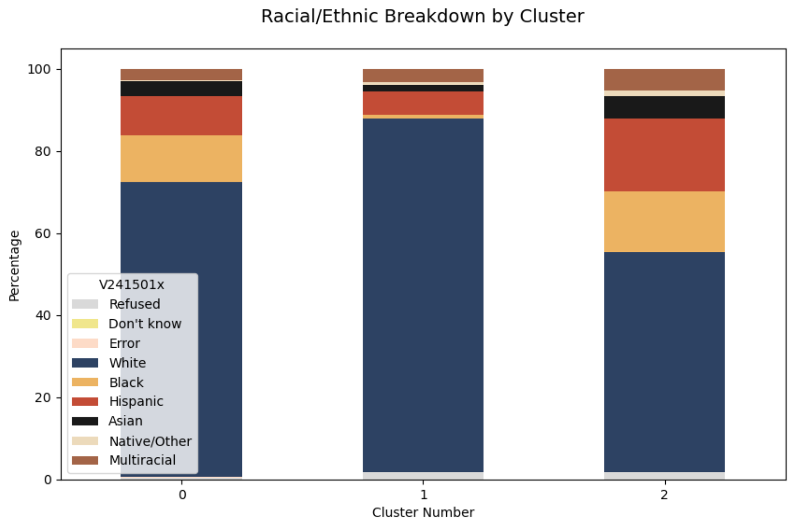
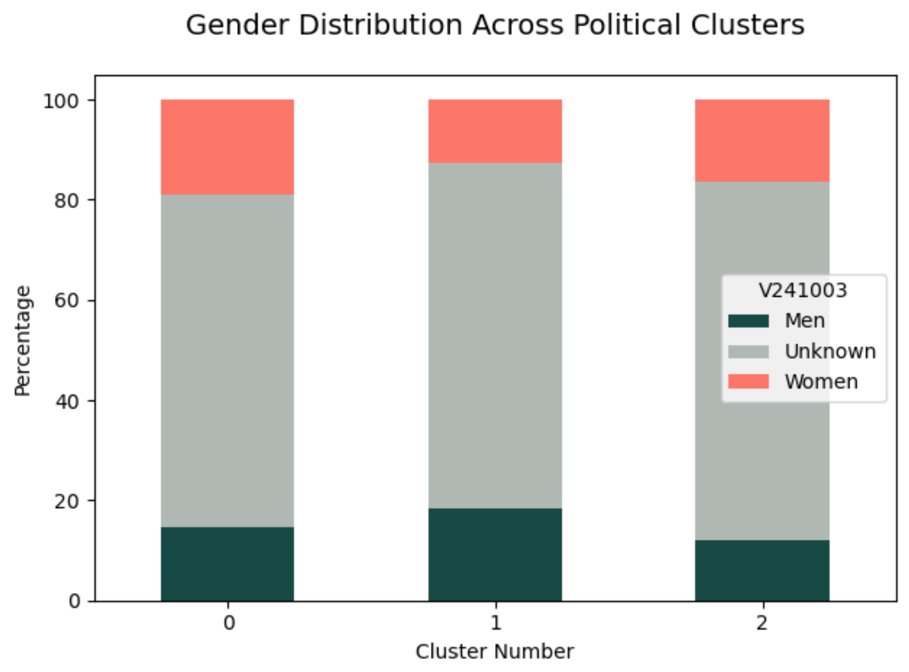
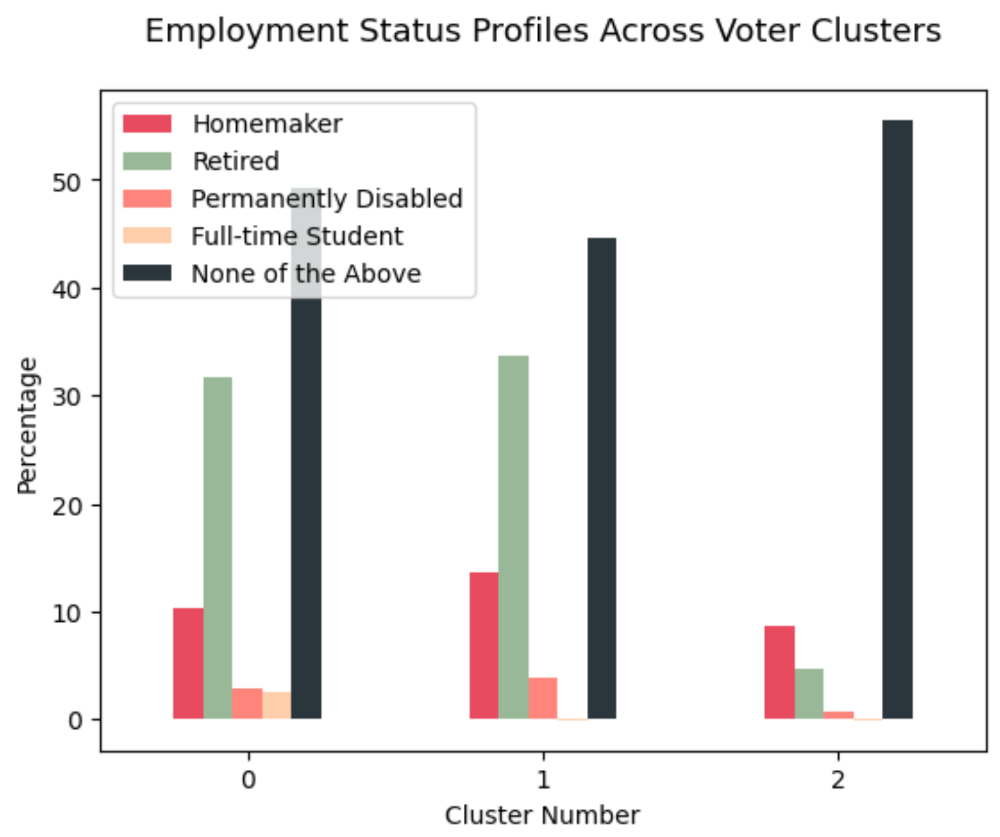
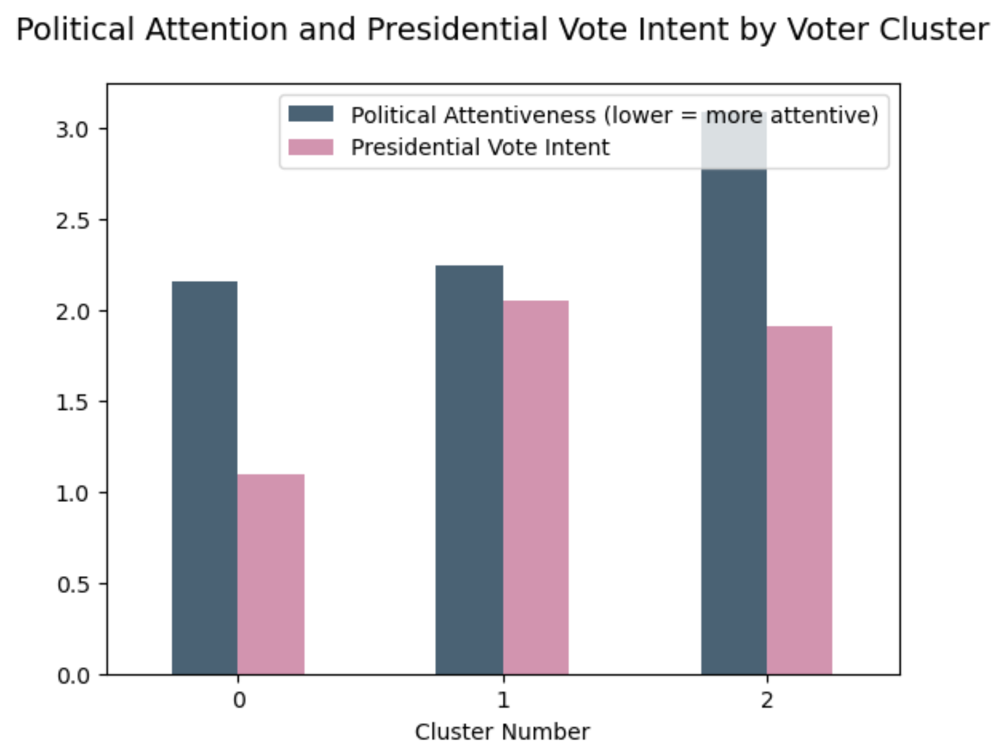

# 🗳️ Voter Clustering Project: Uncovering Behavioral Patterns with K-Means

This project applies unsupervised machine learning techniques to uncover latent voter segments based on demographic and political behavior data. Using K-Means clustering in Python, we group voters by characteristics such as employment, race, gender, and political attention — enabling pattern recognition useful in areas like fraud detection, risk profiling, and political forecasting.

---

## 🔍 Objective

To segment voters into meaningful clusters and analyze their behaviors across multiple variables, with the goal of identifying patterns that might otherwise go unnoticed in aggregated data.

---

## 📊 Methods & Tools

- **Algorithm**: K-Means Clustering
- **Preprocessing**: Standardization, One-Hot Encoding
- **Visualization**: seaborn, matplotlib
- **Tech Stack**: Python (pandas, scikit-learn, matplotlib, seaborn)

---

## 📈 Current Visualizations

### Race Distribution by Cluster

### Gender Breakdown by Cluster  

### Employment Status by Cluster  

### Political Attention vs. Presidential Vote  

---

## 🔧 Next Steps

- Optimize `k` using Elbow Method & Silhouette Score
- Apply **PCA** or **t-SNE** for 2D cluster visualization
- Interpret clusters with summary stats and behavioral insights
- Prepare dashboard or reporting-style summary for external audiences

---

## 📌 Key Takeaways (So Far)

- Distinct patterns exist across voter segments, especially in how demographics intersect with political engagement
- Clustering can help reveal nuanced subgroups often masked in top-line polling
- Techniques used here are transferable to fraud analytics and customer segmentation

---

## 🧠 Applications

- **Political Analysis**: Campaign targeting, typology classification  
- **Fraud & Risk**: Pattern recognition, behavioral segmentation  
- **Marketing**: Psychographic or demographic-based grouping for outreach

---

## 📁 Folder Structure

